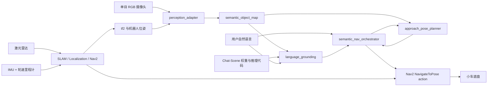

# 3D-MLLM-SLAM：自然语言语义导航项目说明

## 1. 项目目标

在 ROS2 小车上实现以下闭环能力：

1. 用户输入自然语言，例如“去厨房门口”“到沙发旁边”“去红色椅子附近”。
2. 系统将语言解析为一个具名地点或一个带稳定对象 ID 的场景物体。
3. 系统在 `map` 坐标系中计算一个安全、可达、朝向合理的停靠位姿。
4. 系统通过 Nav2 的 `NavigateToPose` action 执行导航。
5. 如果目标未知、歧义过大、物体已经过期或没有安全停靠点，系统拒绝执行或请求澄清，不猜测目标。

本项目不是让大模型直接输出速度控制命令。Chat-Scene 负责语言与场景物体的关联，Nav2 继续负责定位、路径规划、避障和底盘控制。这个职责边界便于在仿真中验证，也适合之后部署到实体小车。

## 2. 当前已知条件与假设

### 已知条件

- 开发环境：WSL2 Ubuntu 22.04。
- ROS2 版本：Humble。
- 已具备 Nav2 等基础环境，并完成过 ROS2 小车实践。
- 实体小车的视觉模块应为单目 RGB 摄像头。
- 实体小车有激光雷达、IMU，预计也有轮速里程计。
- Chat-Scene 在线推理运行在 WSL2 工作站，通过 Wi-Fi 与实体小车通信。
- 仿真计划使用 Gazebo，WSL2 中已有相关环境。
- 已有 Chat-Scene 相关代码和预训练参数权重，但它们尚未放入当前目录。
- 当前项目目录为空，因此本文档按新项目蓝图设计。

### 需要尽早确认

1. 单目摄像头的型号、标定文件、内参、分辨率、帧率、安装位姿和 ROS2 topic。
2. 激光雷达是 2D 还是 3D，topic 和 frame 名称是什么。
3. IMU 与轮速里程计的 topic，以及当前 Nav2 使用的 SLAM、定位和传感器融合方案。
4. 仿真使用 Gazebo Classic 还是 Gazebo Sim，以及已有仿真工程的目录。
5. WSL2 中现有 ROS2 工程、Chat-Scene 代码和权重的实际路径。
6. 第一阶段需要识别的物体集合，以及是否需要支持“左边第二把椅子”这类复杂指代表达。

### 推荐的 MVP 假设

- 小车已有可工作的 Nav2 导航闭环。
- 使用单目 RGB 摄像头进行视频检测、跟踪和视觉特征提取。
- 使用激光雷达、IMU 和轮速里程计完成 Nav2 所需的建图、定位和避障。
- 初版对象地图使用人工标注位置；随后再增加单目多视角三角化和可选的相机-激光雷达关联。
- 先在静态室内环境中工作。
- 第一阶段只支持具名地点和已建图物体，不处理动态跟随任务。
- Chat-Scene 推理运行在 WSL2 工作站，实体小车通过 Wi-Fi 接收目标导航任务。

单目 RGB 视频可以接入 Chat-Scene，但仅靠一帧 2D 图像不能可靠地给 Nav2 提供米制地图坐标。激光雷达可以独立支持 Nav2 的建图、定位和避障，但如果是常见的 2D 激光雷达，也不能自动为所有图像物体提供深度：激光平面可能没有扫到桌面、显示器或较高物体。推荐按以下顺序推进：

1. 先用人工标注的物体位置完成语义导航闭环。
2. 再利用已知相机内参、相机外参、机器人位姿和多帧目标轨迹进行多视角三角化。
3. 对激光平面能够覆盖的物体，可增加相机-激光雷达投影关联作为辅助观测。
4. 单目深度估计可以作为弱先验，但不应直接作为安全导航目标的唯一依据。

## 3. 如何理解论文模型与视频输入

Chat-Scene 的核心不是视频导航控制，而是 3D 场景中的语言理解。论文方法通过对象标识符把场景对象 token 与大语言模型词表中的 ID token 对齐，使模型可以回答“语言指的是场景里的哪个对象”。

官方仓库还提供了 2D 视频处理路径：当没有 3D 输入时，可以使用带跟踪能力的检测器处理视频，并使用 DINOv2 特征构造 2D object token。这说明你的视频输入可以接入模型，但需要注意两个边界：

1. 原始 ROS2 视频流不能直接成为 Nav2 目标。必须先经过检测、跟踪、对象 ID 稳定化和地图坐标关联。
2. Chat-Scene 输出的对象 ID 不能直接成为底盘目标。必须查询语义地图，计算物体附近的安全停靠位姿。

因此，视频与模型的结合方式应当是：

```text
ROS2 视频流
  -> 关键帧采样
  -> 目标检测或实例分割
  -> 多帧跟踪与稳定对象 ID
  -> 人工标注位置，或多视角三角化
  -> 可选：相机-激光雷达关联
  -> tf2 坐标变换到 map
  -> 语义对象地图
  -> Chat-Scene 根据自然语言选择对象 ID
  -> 安全停靠位姿规划
  -> Nav2 NavigateToPose
```

## 4. 推荐架构



### 4.1 Nav2 基础导航层

职责：

- 维护 `map -> odom -> base_link` TF 链。
- 完成 SLAM 或已有地图中的定位。
- 维护 costmap、规划路径、局部避障和恢复行为。
- 接收 `geometry_msgs/PoseStamped` 形式的目标位姿。

原则：

- 大模型不发布 `cmd_vel`。
- 语义导航失败时，不绕过 Nav2 的安全检查。
- 实机保留急停机制，并先限制速度。

### 4.2 视觉感知适配层

输入：

- `sensor_msgs/Image`
- `sensor_msgs/CameraInfo`
- 激光雷达扫描或点云，仅在传感器几何关系允许时用于辅助关联
- 对应时间戳下的 tf2 变换

输出：

- 稳定对象 ID
- 类别、描述、置信度
- `map` 坐标系下的位置和位置不确定度
- 最近观测时间
- 可选的图像裁剪、DINOv2 特征、Chat-Scene object token

推荐分两步实现：

第一步，最小可验证闭环：

1. 使用人工标注的物体 `map` 坐标。
2. 对 RGB 图像做检测或实例分割。
3. 对跨帧对象做跟踪，维持稳定 `track_id`。
4. 将视觉轨迹与人工标注的 `object_id` 关联。

第二步，逐步自动化物体定位：

1. 对 RGB 图像做检测或实例分割。
2. 对跨帧对象做跟踪，维持稳定 `track_id`。
3. 根据相机内参、相机相对 `base_link` 的外参和多帧机器人位姿，对静态对象做射线三角化。
4. 对激光平面能够覆盖的对象，增加相机-激光雷达投影关联。
5. 将融合后的对象位置转换到 `map` 坐标系，并记录不确定度。
6. 对连续观测做保守融合，生成稳定的 `object_id`。

不要假设 2D 激光雷达能够为每个视觉对象提供深度。对象位置不确定度过高时，不应自动发起导航。

### 4.3 语义对象地图层

该层是论文模型与机器人导航之间最关键的桥梁。每个对象至少保存：

```yaml
object_id: chair_0007
label: chair
aliases: ["椅子", "红色椅子"]
position_map: [x, y, z]
confidence: 0.91
last_seen: "ROS timestamp"
source_track_ids: ["track_014"]
status: active
```

第一阶段可以使用 YAML 或 JSON 持久化，不需要数据库。在线节点在内存中维护最新状态，必要时落盘保存地图快照。

### 4.4 语言 grounding 层

语言输入分成两条路径：

| 类型 | 示例 | 解析方式 |
|---|---|---|
| 具名地点 | “去厨房门口” | 查询人工配置的地点注册表 |
| 场景物体 | “到红色椅子旁边” | Chat-Scene 或轻量规则从语义地图中选择对象 ID |

建议先实现一个确定性的 resolver，用于验证完整导航链路；再将 Chat-Scene 接到同一个接口中。这样可以分别定位 ROS2 问题和模型问题。

Chat-Scene 不应同步阻塞控制循环。推荐在独立 Python 进程中加载 PyTorch 模型，由 ROS2 服务节点或 action server 调用。

### 4.5 安全停靠位姿规划层

不能把物体中心直接交给 Nav2，因为物体中心通常位于障碍物内部。应当：

1. 在对象周围按配置半径生成候选点，例如 `0.6 m` 到 `1.0 m`。
2. 让候选位姿朝向目标物体。
3. 使用 costmap 或路径可达性检查过滤障碍点。
4. 优先选择路径较短、离障碍物有余量的点。
5. 没有合法候选点时明确失败。

不同对象可配置不同停靠距离。例如桌子需要更远，门口可能使用人工指定停靠点。

## 5. 建议的 ROS2 工作区结构

```text
3D-MLLM-SLAM/
├── README.md
├── PROJECT_OVERVIEW_CN.md
├── BUILD_PROMPTS.md
├── ros2_ws/
│   └── src/
│       ├── semantic_nav_interfaces/
│       ├── semantic_object_map/
│       ├── semantic_nav_orchestrator/
│       ├── language_grounding/
│       ├── perception_adapter/
│       └── semantic_nav_bringup/
├── ml/
│   ├── chat_scene/              # 后续接入已有代码，建议保留上游结构
│   ├── adapters/
│   └── configs/
├── config/
│   ├── named_locations.yaml
│   ├── object_map.yaml
│   └── approach_distances.yaml
├── scripts/
├── tests/
└── docs/
```

不要一开始复制或改写 Chat-Scene 上游代码。优先将已有代码作为独立模块接入，在 `ml/adapters/` 中处理 ROS2 语义地图快照与模型输入格式之间的转换。

## 6. 技术栈

| 层 | 推荐技术 |
|---|---|
| 操作系统 | WSL2 Ubuntu 22.04；实机按底盘环境部署 |
| ROS2 | ROS2 Humble、colcon、ament |
| 导航 | Nav2、`nav2_msgs/action/NavigateToPose` |
| 定位与建图 | 激光雷达、IMU、轮速里程计；已有 Nav2 配套方案；可选 `slam_toolbox`、AMCL、`robot_localization` |
| 坐标变换 | `tf2_ros`、`message_filters` |
| 视觉与测距消息 | `sensor_msgs/Image`、`sensor_msgs/CameraInfo`、`sensor_msgs/LaserScan`、可选 `sensor_msgs/PointCloud2` |
| ROS2 Python 接口 | `rclpy`，用于快速实现语义地图、模型桥接和 orchestrator |
| 性能敏感节点 | 必要时使用 `rclcpp` |
| 模型运行时 | Python、PyTorch、CUDA、Chat-Scene 代码与已有权重 |
| 视觉特征 | 官方 2D 视频路径涉及跟踪式检测器与 DINOv2；具体版本应按已有代码锁定 |
| 配置与持久化 | YAML、JSON、rosbag2 |
| 测试 | `pytest`、`launch_testing`、ROS2 仿真、rosbag 回放 |

## 7. 分阶段构建计划

### 阶段 0：确认底座

目标：证明现有小车或仿真可以稳定接收 Nav2 位姿目标。

验收：

- 能在 RViz 中发送目标点并完成导航。
- TF 树正确，目标统一使用 `map` 坐标系。
- WSL2 与实体小车之间的 DDS 通信完成单独验证。

### 阶段 1：确定性的语义导航骨架

目标：先不加载大模型，用 YAML 中的具名地点和静态对象完成闭环。

验收：

- 输入“去充电区”可导航到人工配置位姿。
- 输入“去椅子附近”可选择对象并生成安全停靠位姿。
- 对未知目标返回明确失败。

### 阶段 2：单目 RGB 语义地图感知

目标：从单目 RGB 视频维护稳定对象 ID；先使用人工标注位置，再引入多视角三角化和可选的相机-激光雷达关联更新对象位置。

验收：

- 物体跨帧保持稳定 ID。
- 对象位置能正确显示在 RViz 的 `map` 坐标系中。
- 小车移动后，同一静态对象的位置不会明显漂移。
- 位置不确定度过高的对象不会触发导航。
- 过期对象不会继续作为导航目标。

### 阶段 3：离线接入 Chat-Scene

目标：使用 rosbag 或录制视频生成场景快照，调用已有权重完成对象指代解析。

验收：

- 对预先定义的语言测试集输出正确对象 ID。
- 模型输入、输出、推理时延和显存占用被记录。
- 不修改 Nav2 层即可切换规则 resolver 与 Chat-Scene resolver。

### 阶段 4：在线 Chat-Scene 语义导航

目标：将语言 grounding 变为 ROS2 可调用服务，完成端到端仿真。

验收：

- 用户语言命令能触发一次可追踪的导航任务。
- 模型超时、歧义、空结果和对象过期时，小车不会运动。
- 导航过程仍由 Nav2 执行，并可以取消。

### 阶段 5：实体小车部署

目标：在受控室内场景中低速验证。

验收：

- 急停有效。
- 网络中断时不会产生新的运动指令。
- 目标附近停靠距离符合配置。
- 至少覆盖具名地点、单一对象、同类多对象、目标消失和不可达目标。

## 8. 关键决策与取舍

| 决策 | 选择 | 原因 | 代价 |
|---|---|---|---|
| 模型职责 | 只做语言 grounding | 保留 Nav2 的成熟安全边界 | 需要语义地图桥接层 |
| MVP 视觉 | 单目 RGB，先人工标注对象位置 | 匹配现有硬件，先验证主链路 | 自动对象定位延后实现 |
| 自动对象定位 | 多视角三角化，可选 lidar 关联 | 利用已有相机、雷达与机器人位姿 | 需要标定、时序同步和不确定度过滤 |
| Nav2 感知 | lidar + IMU + 轮速里程计 | 与视觉语义层解耦，保留成熟导航闭环 | 需要核对现有 topic 与 TF |
| 模型进程 | 与 ROS2 控制节点隔离 | 避免模型崩溃阻塞控制 | 需要定义清晰接口 |
| 第一阶段存储 | YAML / JSON | 简单、可调试 | 不适合大规模动态场景 |
| 第一阶段环境 | 静态室内场景 | 降低感知和规划复杂度 | 动态目标留待后续 |

## 9. 主要风险与缓解方式

| 风险 | 影响 | 缓解方式 |
|---|---|---|
| 单目 RGB 没有直接深度 | 无法从单帧图像稳定生成地图位姿 | MVP 先人工标注；再做多视角三角化，并按条件增加 lidar 关联 |
| 误以为 2D lidar 能覆盖所有视觉目标 | 部分对象深度关联错误 | 将 lidar 关联视为辅助观测，记录位置不确定度，不满足阈值则拒绝导航 |
| 对象 ID 在多帧中漂移 | 语言选中对象与地图对象不一致 | 使用跟踪、空间聚类和时间戳；为对象增加过期机制 |
| 直接导航到对象中心 | 目标点落在障碍物中 | 单独实现 approach pose planner |
| 大模型推理过慢 | 交互延迟高，甚至阻塞控制 | 独立进程、异步请求、超时后拒绝执行 |
| 语言歧义 | 小车去往错误对象 | 返回候选列表或要求澄清，不自动猜测 |
| WSL2 与实机的 Wi-Fi / DDS 网络不稳定 | 仿真可用但部署失败，模型结果无法可靠下发 | 在模型接入前完成跨机 ROS2 topic、action 与 TF 测试；断网时禁止生成新任务 |
| CUDA、PyTorch 与已有权重版本不一致 | 模型无法加载 | 按已有仓库锁定依赖，单独记录模型环境 |

## 10. 暂不纳入 MVP 的内容

- 让大模型直接控制速度。
- 在运动中追踪并跟随动态人物。
- 同时重构 Chat-Scene 上游训练代码。
- 一开始就引入复杂数据库、微服务或云端部署。
- 在未完成仿真和低速测试前进行开放环境实机运行。

## 11. 推荐的下一步

在开始写 ROS2 包之前，先读取 WSL2 中现有 ROS2 工程，补齐摄像头、激光雷达、IMU、轮速里程计的 topic，TF 树，Nav2 launch 文件，Gazebo 工程和 Chat-Scene 代码路径。随后按照 [BUILD_PROMPTS.md](./BUILD_PROMPTS.md) 逐步构建，每一步只引入一个可验证能力。

## 12. 如何提供 WSL2 中的现有工程

现有 ROS2 代码值得先检查。它会决定新包应该放在哪里，以及哪些 launch、Nav2 参数、URDF、传感器 topic 和 TF 可以直接复用。

当前 Codex 桌面会话中，`wsl.exe --list --verbose` 没有发现已注册的 Linux 发行版，`\\wsl$` 路径也不存在，因此暂时无法直接读取你平时使用的 WSL2 文件。可以选择以下任一方式提供工程：

1. 如果 WSL2 能被当前 Windows 会话访问，提供 UNC 路径，例如 `\\wsl.localhost\Ubuntu-22.04\home\<用户名>\<工程目录>` 或 `\\wsl$\Ubuntu-22.04\home\<用户名>\<工程目录>`。
2. 如果 Windows 侧可以调用发行版，提供发行版名称和 Linux 路径，例如 `Ubuntu-22.04` 与 `/home/<用户名>/<工程目录>`。后续可通过 `wsl.exe -d Ubuntu-22.04 -- bash -lc '...'` 检查。
3. 如果当前 Codex 会话与日常 WSL2 不在同一个 Windows 环境，把现有 ROS2 工程、Gazebo 工程、配置文件复制到本项目的 `external/` 或 `reference/` 子目录。权重文件较大时，只需先提供路径、目录结构和环境文件，不必复制权重。

优先提供以下内容：

- ROS2 workspace 中的 `src/`。
- Nav2 launch 文件、参数 YAML、地图文件。
- URDF / Xacro、传感器配置、Gazebo world 和模型。
- `ros2 topic list`、`ros2 topic info`、`ros2 run tf2_tools view_frames` 的结果。
- Chat-Scene 代码目录、环境文件、checkpoint 文件名和路径。

## 13. 参考资料

- Chat-Scene 论文页面：[Chat-Scene: Bridging 3D Scene and Large Language Models with Object Identifiers](https://arxiv.org/abs/2312.08168)
- Chat-Scene 官方仓库：[ZzZZCHS/Chat-Scene](https://github.com/ZzZZCHS/Chat-Scene)
- 官方仓库中的预处理目录：[preprocess](https://github.com/ZzZZCHS/Chat-Scene/tree/dev/preprocess)
- Nav2 Humble action 文档：[NavigateToPose](https://api.nav2.org/actions/humble/navigatetopose.html)
- Nav2 文档：[Navigation Concepts](https://docs.nav2.org/concepts/index.html)
